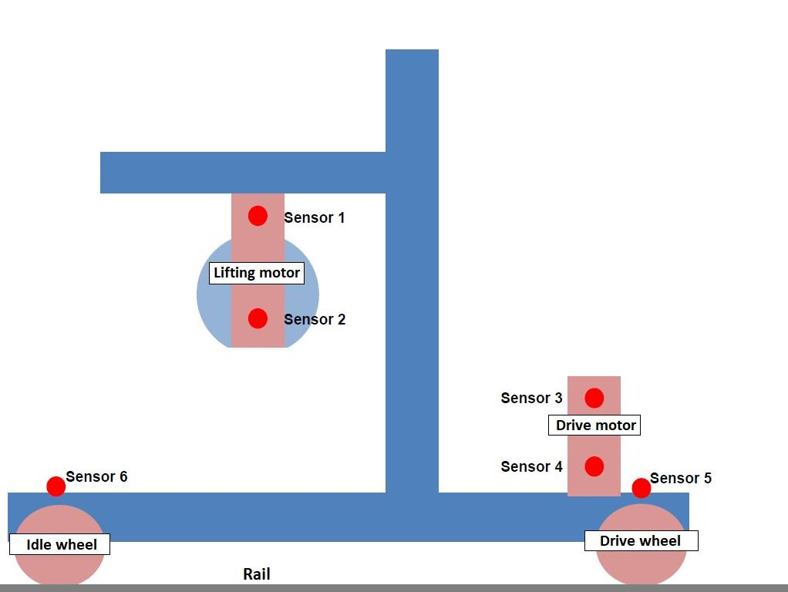
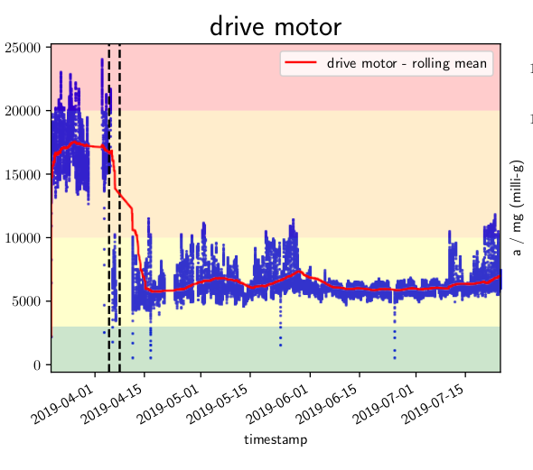
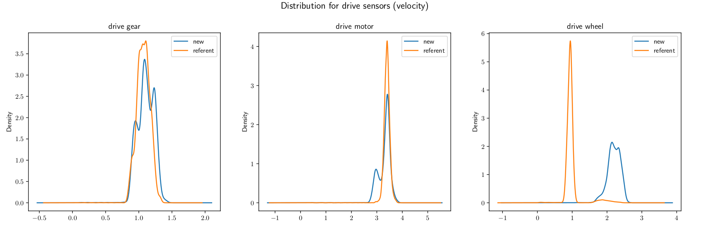

# Predictive maintenance for lifting machines in warehouses - LUMEN Data Science 2020
## About the project
The goal of this project was to create a predictive maintenance software for lifting machines in warehouses. 

It was developed by the team of 4 people: 
- Luka Jovanović
- Damjan Grubelić
- Antonela Bogdanić
- Josip Klepec

under the team name `#exclude <corona>` as part of the LUMEN Data Science 2020 competition.  Our team won **5th place** in the final ranking.

## Business problem
Failures of small parts in a machine can lead to a costly breakdown of the whole machine. Therefore, it is important to perform maintenance. The usual approach is to do it in fixed intervals. This leaves two risks: If the interval has been set too long, parts could fail just before maintenance is due, if it has been set too short, the maintenance does not find anything wrong. Furthermore, different parts have different lifespans, so a fixed interval for the whole machine is also not the most efficient way. The approach that solves these issues is predictive maintenance, where  historical data for a component is used to predict when will it fail. Therefore, the maintenance can be done focused only on the part that is about to fail and just before it will do so - thus, greatly reducing cost.

The goal is to analyze data coming from seven automated storage and retrieval systems, large machines equipped with six different sensors. 

The full problem statement is available in `Problem-statement.pdf`.

The following is a sketch of one machine and its sensors:

## Solution
Our solution is a software that analyzes timeseries of measurements obtained from sensors on the machine, and early diagnosing whether a machine needs repairs.

There are two main components of the solution:

### 1. Classification of vibration severity
-  Measurements are classified into 4 categories depending on severity, according to **ISO 10816** vibration severity standard.

*Example: The following timeseries show a drop in vibration levels of the drive motor after a performed maintenance.*

### 2. Anomaly detection
- Each part of the machine has its own *regular* vibration level, determined by previous measurements. Anomaly detection helps figuring out if a machine is starting to malfunction by detecting and reporting unexpected changes in vibration levels.

*Example: The following distribution plots are part of the anomaly detection algorithm and indicate a potential problem occuring at the drive wheel (last subplot).*

## Run the software
To run the software, start the CLI (Command Line Interface) by executing `python ui.py` in the `python` directory. 

You will need to provide the measurements data in a `.csv` file, in a format described in Section 7 of `Problem-statement.pdf`.

**NOTE:** Data used during the competition is **not published** here because it is the property of *Atomic Intelligence d.o.o.* 

There are three examples showing the resulting analyses (in `.pdf` format) generated by the software in `examples` directory. 
